# 2024-C

## Question 1  励磁波形分类

### 1、三种波形绘制图像（附件一中材料1每种波形第一条数据绘制）

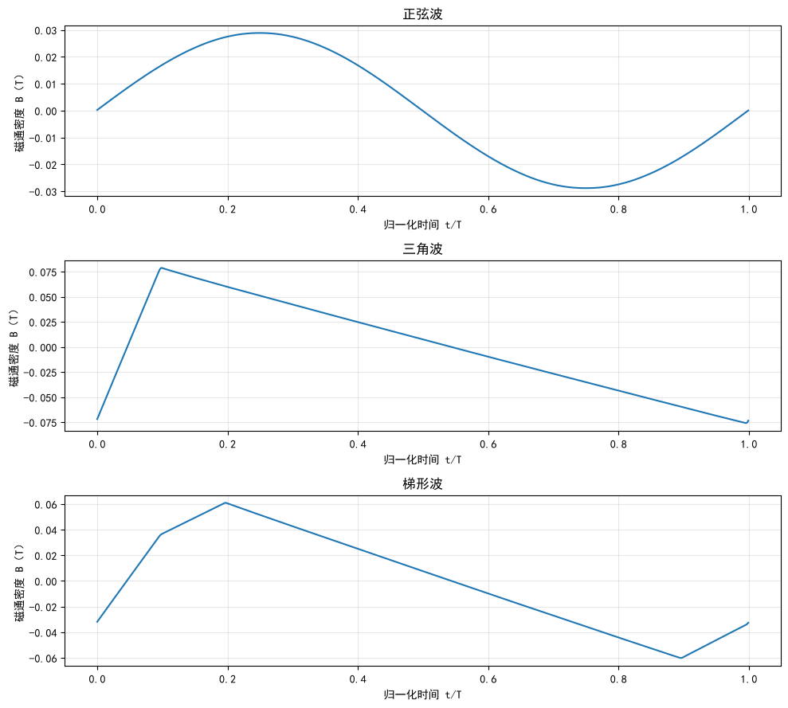

### 2、三种波形随机样本对比（附件一材料1中每个波形随机选10条数据）

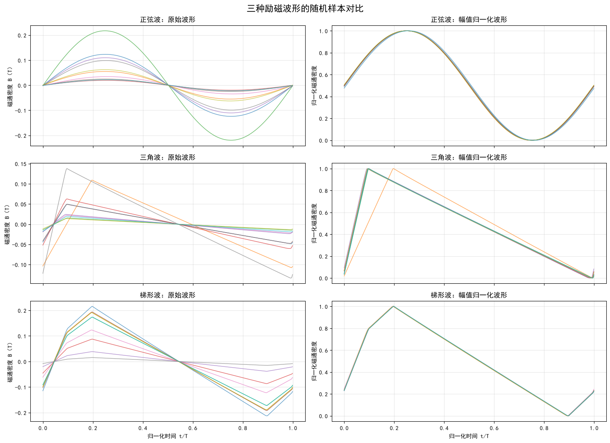

* 正弦波：斜率连续变化，一阶差分取值较分散；

* 三角波：主要有一个正斜率和一个负斜率；

* 梯形波：通常存在多种斜率水平，例如快速上升、缓慢上升、缓慢下降和快速下降。

### 3、四种材料-三种波形的一阶差分

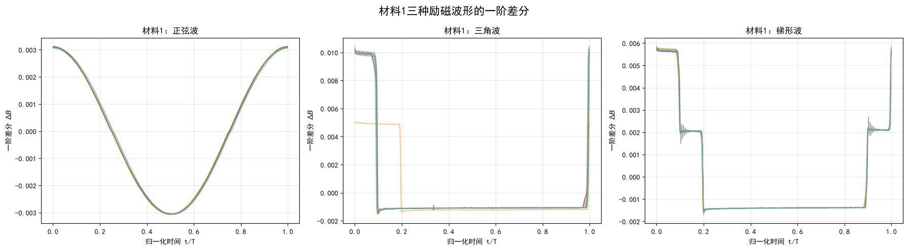

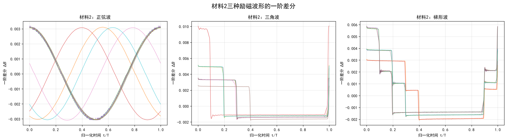

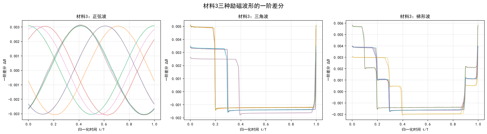

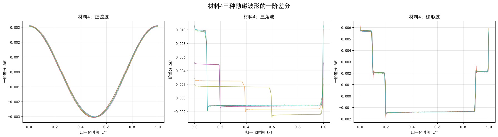

### 5、附件一训练集基本分布

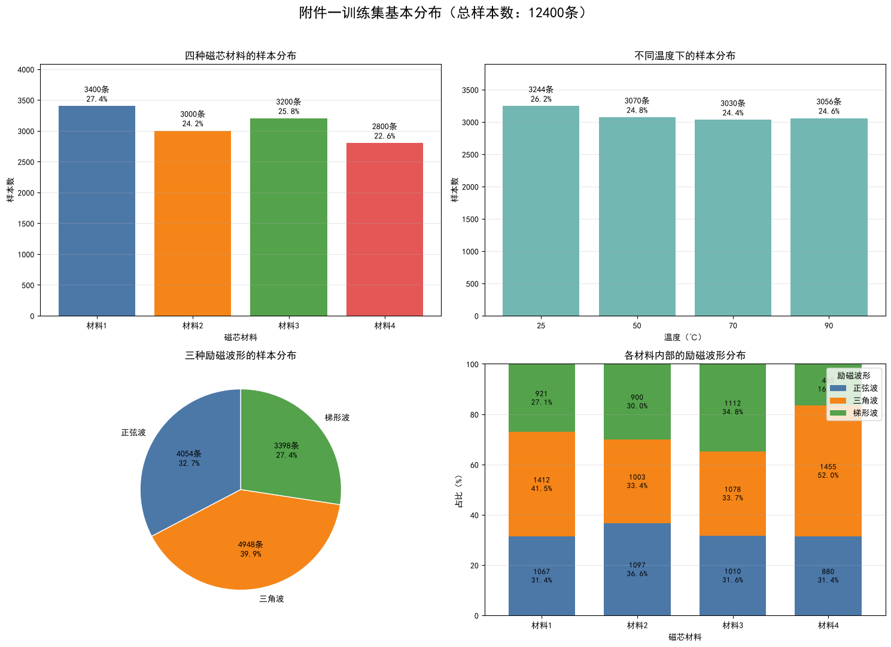

### 

## 随机森林模型

### 1、模型训练

为识别正弦波、三角波和梯形波，首先对每条磁通密度序列进行幅值归一化，随后计算归一化波形的一阶差分。为降低波形起始相位不同对分类结果的影响，从一阶差分中提取分位数、标准差、偏度、峰度、最大值和最小值等46个相位不敏感特征，并将其作为随机森林分类模型的输入。

按照8:2的比例对12400条样本进行分层随机划分，其中训练集包含9920条样本，验证集包含2480条样本。分层划分保证了训练集与验证集中三类波形的类别比例基本一致。

| 励磁波形 | 训练集样本数 | 验证集样本数 | 总样本数 |
| -------- | ------------ | ------------ | -------- |
| 正弦波   | 3243         | 811          | 4054     |
| 三角波   | 3958         | 990          | 4948     |
| 梯形波   | 2719         | 679          | 3398     |
| 合计     | 9920         | 2480         | 12400    |

随机森林模型设置300棵决策树，采用平方根特征抽样策略，并通过类别平衡权重减小类别数量差异的影响。模型在验证集上的准确率为：100%

### 2、训练结果

| 励磁波形 | 精确率 Precision | 召回率 Recall | F1值   | 验证样本数 |
| -------- | ---------------- | ------------- | ------ | ---------- |
| 正弦波   | 1.0000           | 1.0000        | 1.0000 | 811        |
| 三角波   | 1.0000           | 1.0000        | 1.0000 | 990        |
| 梯形波   | 1.0000           | 1.0000        | 1.0000 | 679        |
| 宏平均   | 1.0000           | 1.0000        | 1.0000 | 2480       |
| 加权平均 | 1.0000           | 1.0000        | 1.0000 | 2480       |

模型对应的混淆矩阵如下。

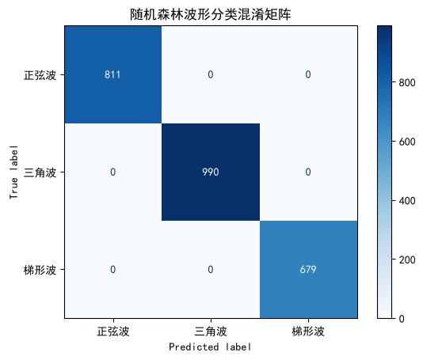

由分类结果可知，随机森林模型正确识别了验证集中的全部2480条样本，三种励磁波形均未出现误分类。正弦波、三角波和梯形波的精确率、召回率与F1值均达到1.0000，宏平均F1和加权平均F1也均为1.0000。

这一结果表明，三种励磁波形的一阶差分具有显著不同的分布特征。正弦波的一阶差分连续且平滑变化；三角波的一阶差分主要表现为两个稳定斜率区段；梯形波的一阶差分则表现为多个稳定斜率区段。由一阶差分构造的统计特征能够有效描述三种波形之间的形状差异，随机森林模型能够建立清晰的分类边界。

目前结果来自一次分层随机划分。虽然验证结果表明模型具有较好的分类能力，但还需要进行分层五折交叉验证和按材料留一验证，以进一步排除数据划分偶然性以及同种材料样本相似性对分类结果的影响。

### 3、结果验证

为进一步检验分类模型对不同磁芯材料的泛化能力，采用按材料**留一法**进行验证。每次将一种磁芯材料的全部样本作为测试集，其余三种材料的样本作为训练集，重复四次，使四种材料分别作为独立测试集。该验证方式比普通随机划分更加严格，可以检验模型在面对训练阶段未出现的磁芯材料时是否仍能准确识别励磁波形。

| 测试材料 | 测试样本数 | 准确率    | 宏平均精确率 | 宏平均召回率 | 宏平均F1  |
| -------- | ---------- | --------- | ------------ | ------------ | --------- |
| 材料1    | 3400       | 100.0000% | 100.0000%    | 100.0000%    | 100.0000% |
| 材料2    | 3000       | 100.0000% | 100.0000%    | 100.0000%    | 100.0000% |
| 材料3    | 3200       | 100.0000% | 100.0000%    | 100.0000%    | 100.0000% |
| 材料4    | 2800       | 100.0000% | 100.0000%    | 100.0000%    | 100.0000% |

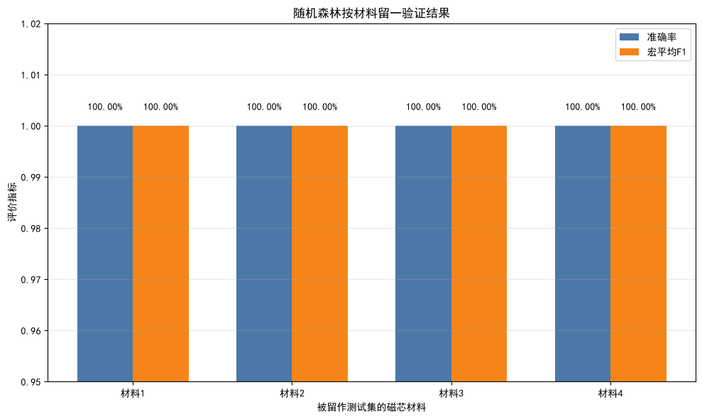

由验证结果可知，当材料1、材料2、材料3和材料4分别作为独立测试集时，随机森林模型的准确率、宏平均精确率、宏平均召回率和宏平均F1均达到100%。这表明所提取的一阶差分统计特征能够有效反映励磁波形本身的形状规律，受磁芯材料变化的影响较小。模型学习到的是正弦波、三角波和梯形波之间的斜率分布差异，而非特定材料的数据特征。

结合分层验证集、五折交叉验证和按材料留一验证结果，可以认为该随机森林模型具有较高的分类精度、稳定性和跨材料泛化能力。

## Question 2 SE方程修正

### SE方程系数求解思路

每个固定温度下，SE方程可表示为：$ P=k_T f^{\alpha_T}B_m^{\beta_T}$​

其中：

P：磁芯损耗；

f：频率；

$B_m$：磁通密度峰值；

$k_T$、$α_T$、$β_T$​​：温度 T下的待拟合参数

对于每条样本，根据一个周期内的1024个磁通密度采样点计算：

$B_{\max}=\max_{1\leq i\leq 1024}(B_i)$​

$B_{\min}=\min_{1\leq i\leq 1024}(B_i)$​

考虑到实测磁通密度可能存在少量直流偏移，采用半峰峰值表示磁通密度峰值：

$B_m=\frac{B_{\max}-B_{\min}}{2}$​

为了便于拟合参数，对斯坦麦茨方程两边取自然对数：

$\ln P=\ln k_T+\alpha_T\ln f+\beta_T\ln B_m$

令$y=\ln P$,  $x_1=\ln f$,   $x_2=\ln B_m$​

则原方程可以转化为多元线性回归形式：

$y=c_T+\alpha_T x_1+\beta_T x_2$​

其中：

$c_T=\ln k_T$​

利用最小二乘法拟合多元线性回归，可以得到 $c_T$、$α_T$、$β_T$，随后计算：

$k_T=e^{c_T}$

 

**分别拟合4个温度下的SE参数、分析参数随温度变化规律、按温度分层划分训练集和验证集、拟合统一传统SE模型、拟合温度修正SE模型、在相同验证集上比较误差**

### 标准SE方程系数拟合

对四种磁芯材料在25℃、50℃、70℃和90℃下的正弦波样本分别拟合传统斯坦麦茨方程，得到不同材料和温度对应的模型参数及拟合误差。结果表明，温度变化会显著影响斯坦麦茨方程的参数和预测精度。

在四种磁芯材料中，参数随温度变化呈现较为一致的规律。随着温度升高，参数 \($ln k$) 整体明显下降，频率指数 \($α$) 持续增大，磁通密度指数 \($β$) 总体呈缓慢增大的趋势。这说明温度不仅影响斯坦麦茨方程的比例系数 ($k$​)，还会影响频率和磁通密度对磁芯损耗的作用程度。

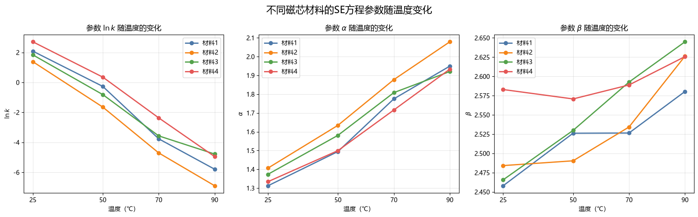

不同材料和温度下传统斯坦麦茨方程的平均绝对百分比误差如下。

| 磁芯材料 | 25℃   | 50℃    | 70℃    | 90℃    |
| -------- | ----- | ------ | ------ | ------ |
| 材料1    | 6.39% | 7.76%  | 14.46% | 17.53% |
| 材料2    | 9.82% | 12.99% | 19.05% | 22.68% |
| 材料3    | 9.62% | 12.97% | 18.00% | 21.29% |
| 材料4    | 8.05% | 10.93% | 15.87% | 19.84% |

由表中结果可知，四种材料的MAPE均随温度升高而增加。传统斯坦麦茨方程在25℃和50℃下具有较好的拟合效果，但在70℃和90℃下的预测相对误差明显增大。其中，四种材料在90℃下的MAPE均达到最大值，表明传统斯坦麦茨方程在高温条件下的预测稳定性有所下降。

### 修正SE方程

#### 1、标准统一SE基准模型

可以将下面内容直接复制到 Markdown 文件中，没有使用大小标题。

**统一传统斯坦麦茨方程的建立**

选取附件一中材料1的全部正弦波样本，共1067条。以频率 (f) 和磁通密度峰值 (B_m) 为自变量，以实测磁芯损耗 (P) 为因变量。其中，磁通密度峰值定义为：

$$
B_m=\frac{B_{\max}-B_{\min}}{2}
$$

统一传统斯坦麦茨方程为：

$$
P=kf^\alpha B_m^\beta
$$

对方程两侧取自然对数，将非线性方程转换为多元线性方程：

$$
\ln P=\ln k+\alpha\ln f+\beta\ln B_m
$$

按照8:2的比例划分训练集和验证集，并根据温度进行分层抽样，以保证25℃、50℃、70℃和90℃样本在训练集和验证集中的比例基本一致。使用训练集对对数变换后的方程进行最小二乘拟合。

拟合得到的参数为：

| 参数           | 估计值                    |
| -------------- | ------------------------- |
| ($ln k$)       | -1.652560                 |
| 原始 (k)       | $1.91558964\times10^{-1}$ |
| 反变换校正因子 | 1.065816                  |
| 校正后 ($k$)   | $2.04166684\times10^{-1}$ |
| ($\alpha$)     | 1.606077                  |
| ($\beta$)      | 2.509531                  |

由于模型在对数空间中进行拟合，直接进行指数反变换可能产生系统偏差，因此采用Duan反变换校正因子对预测值进行修正。校正后的统一传统斯坦麦茨方程为：

$$
2.04166684\times10^{-1}
f^{1.606077}
B_m^{2.509531}
$$
统一传统斯坦麦茨方程在训练集和验证集上的评价结果如下：

| 数据集 | MSE             | MAE        | RMSE       | MAPE     | ($R^2$)  |
| ------ | --------------- | ---------- | ---------- | -------- | -------- |
| 训练集 | 1818881987.9768 | 21602.2099 | 42648.3527 | 32.7100% | 0.936397 |
| 验证集 | 1532840666.9505 | 20579.7077 | 39151.5091 | 31.1635% | 0.954671 |

训练集和验证集的评价指标较为接近，验证集的 ($R^2$) 略高于训练集，没有表现出明显的过拟合现象。验证集 ($R^2$) 达到0.954671，说明统一传统SE方程能够解释磁芯损耗总体变化的95%以上。

但是，验证集MAPE达到31.1635%，说明模型的相对预测误差仍然较大。磁芯损耗数据跨越多个数量级，因此较大的损耗值会对 (R^2) 产生较强影响。较高的 (R^2) 并不代表每个样本的相对预测误差都较小。

进一步计算统一传统SE方程在不同温度下的验证误差，结果如下：

| 温度 | 样本数 | MSE             | MAE        | RMSE       | MAPE     | ($R^2$)  |
| ---- | ------ | --------------- | ---------- | ---------- | -------- | -------- |
| 25℃  | 55     | 2999910565.6675 | 31224.1741 | 54771.4393 | 32.2105% | 0.906924 |
| 50℃  | 51     | 95693815.5982   | 5351.3723  | 9782.3216  | 11.2386% | 0.998360 |
| 70℃  | 53     | 1579885430.1704 | 23034.2645 | 39747.7726 | 28.6143% | 0.941335 |
| 90℃  | 55     | 1353063804.0209 | 21690.7612 | 36784.0156 | 51.0487% | 0.919913 |

统一传统SE方程在50℃下的预测效果最好，MAPE仅为11.2386%，而在90℃下的MAPE达到51.0487%。不同温度下的预测误差存在显著差异，说明使用一组固定的 ($k$)、($\alpha$) 和 ($\beta$) 参数无法充分描述温度变化对磁芯损耗的影响。

实测值与预测值的散点图也表现出明显的温度分层现象。不同温度的样本相对于理想预测线存在不同方向和不同程度的系统偏移，进一步说明模型误差并非完全由随机扰动造成，而是与温度因素有关。

因此，统一传统斯坦麦茨方程可以作为后续模型优化的基准模型。下一步将在保持 ($\alpha$) 和 ($\beta$) 不变的情况下，首先研究温度对参数 ($k$) 的影响，并检验加入温度修正项后模型预测误差是否得到降低。

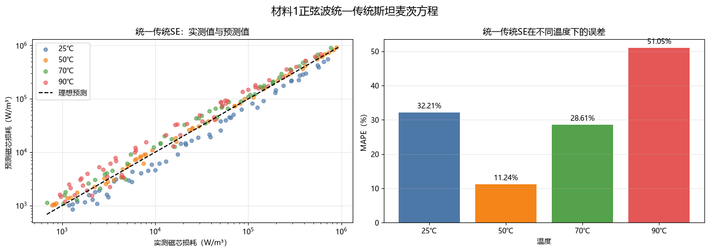

#### 2、**第一轮温度修正：引入温度对参数 ($k$) 的影响**

统一传统斯坦麦茨方程没有考虑温度因素，在不同温度下表现出明显的预测误差差异。因此，第一轮优化仅假设参数 \(k\) 随温度变化，而参数 \($\alpha$\) 和 \($\beta$\) 不随温度变化。

为减小温度数值范围对参数估计的影响，将温度转换为对称归一化变量：
$$
\theta=\frac{T-57.5}{32.5}
$$
归一化后，25℃对应 \($\theta=-1$\)，90℃对应 \($\theta=1$\)。

假设参数 \($k$\) 随温度呈指数变化：
$$
k(T)=k_0\exp(c_1\theta)
$$
将其代入传统斯坦麦茨方程，得到第一轮温度修正方程：
$$
P=k_0\exp(c_1\theta)f^\alpha B_m^\beta
$$
对方程两侧取自然对数：
$$
ln P = \ln k_0+c_1\theta+\alpha\ln f+\beta\ln B_m
$$
该方程可以采用多元线性回归求解。本轮模型中，\($\alpha$\) 和 \($\beta$\) 会重新估计，但二者不随温度变化。

拟合得到的参数如下：

| 参数          | 参数含义                  | 估计值                    |
| ------------- | ------------------------- | ------------------------- |
| \($\ln k_0$\) | 回归模型截距              | -2.038461                 |
| \($k_0$\)     | 指数反变换后的原始系数    | $1.30228943\times10^{-1}$ |
| ($s$)         | Duan反变换校正因子        | 1.022635                  |
| \($k_0^\ast)$ | 校正后的比例系数          | $1.33176715\times10^{-1}$ |
| \($\alpha$\)  | 频率指数                  | 1.644754                  |
| \($\beta$\)   | 磁通密度指数              | 2.526747                  |
| \($c_1$\)     | 参数 \(k\) 的温度影响系数 | -0.389742                 |

校正后的比例系数为：
$$
k_0^\ast=s\exp(\ln k_0)
$$
因此，第一轮温度修正方程为：
$$
\hat P = 1.33176715\times10^{-1} \exp(-0.389742\theta) f^{1.644754} B_m^{2.526747}
$$
其中：
$$
\theta=\frac{T-57.5}{32.5}
$$
由于 \($c_1=-0.389742<0$\)，说明在其他条件保持不变时，等效系数 \(k(T)\) 随温度升高而减小。根据拟合结果：

$\frac{k(90)}{k(25)} = \exp(2c_1) \approx 0.459$ 

即90℃下的等效系数 \($k$\) 约为25℃下的45.9%。

统一传统SE与第一轮温度修正SE在验证集上的结果如下：

| 模型                    | MSE             | MAE        | RMSE       | MAPE     | \($R^2$\) |
| ----------------------- | --------------- | ---------- | ---------- | -------- | --------- |
| 统一传统SE              | 1532840666.9505 | 20579.7077 | 39151.5091 | 31.1635% | 0.954671  |
| 仅修正 \($k$\) 的温度SE | 721436665.6933  | 12615.3081 | 26859.5731 | 17.0020% | 0.978666  |

第一轮优化前后的指标变化如下：

| 评价指标 | 统一传统SE | 第一轮温度修正SE | 改善情况     |
| -------- | ---------- | ---------------- | ------------ |
| MAPE     | 31.1635%   | 17.0020%         | 降低45.44%   |
| RMSE     | 39151.5091 | 26859.5731       | 降低31.40%   |
| \($R^2$) | 0.954671   | 0.978666         | 提高0.023995 |

MAPE的降低比例为：
$$
\frac{31.1635-17.0020}{31.1635}\times100\% = 45.44\%
$$
RMSE的降低比例为： 
$$
\frac{39151.5091-26859.5731}{39151.5091}\times100\% = 31.40\%
$$
决定系数的提高量为：
$$
0.978666-0.954671 = 0.023995
$$
仅在参数 \($k$\) 中加入温度修正项，就使验证集MAPE由31.1635%下降至17.0020%，RMSE由39151.5091下降至26859.5731，同时 \($R^2$\) 提高至0.978666。这说明温度对磁芯损耗存在显著影响，并且温度首先表现为对斯坦麦茨方程整体比例系数的调节。

不同温度下的验证结果如下：

| 温度 | 样本数 | 统一SE MAPE | 修正SE MAPE | MAPE降低比例 | 统一SE \($R^2$\) | 修正SE \($R^2$\) |
| ---- | ------ | ----------- | ----------- | ------------ | ---------------- | ---------------- |
| 25℃  | 55     | 32.2105%    | 14.7763%    | 54.13%       | 0.906924         | 0.978027         |
| 50℃  | 51     | 11.2386%    | 17.2881%    | -53.83%      | 0.998360         | 0.978969         |
| 70℃  | 53     | 28.6143%    | 15.1422%    | 47.08%       | 0.941335         | 0.995045         |
| 90℃  | 55     | 51.0487%    | 20.7545%    | 59.34%       | 0.919913         | 0.950744         |

第一轮温度修正在25℃、70℃和90℃下均取得了明显改善。其中，90℃下的MAPE由51.0487%下降至20.7545%，降低比例达到59.34%。这说明温度修正项有效减弱了统一传统SE在高温条件下的系统偏差。

但是，50℃下的MAPE由11.2386%上升至17.2881%，对应的 \($R^2$\) 也由0.998360下降至0.978969。这是因为统一传统SE在50℃下原本就具有较高的拟合精度，而单一的指数温度修正需要同时兼顾全部温度，导致50℃附近的预测发生偏移。

从实测值与预测值的散点图可以看出，加入 \($k(T)$) 后，预测点整体上更加接近理想预测线，原有的温度分层现象得到明显缓解。不过，不同温度下仍然存在一定的系统误差，表明温度不仅改变了磁芯损耗的整体大小，还可能改变频率对磁芯损耗的影响程度。

总体而言，第一轮温度修正使模型整体预测效果得到显著提升，因此应当保留 \($k(T)$\) 温度修正项。但仅调整比例系数 \($k$\) 仍不能充分描述不同温度下的全部变化规律，下一步将在保留 \($k(T)$\) 的基础上，引入频率指数 \($\alpha$\) 的温度变化项。

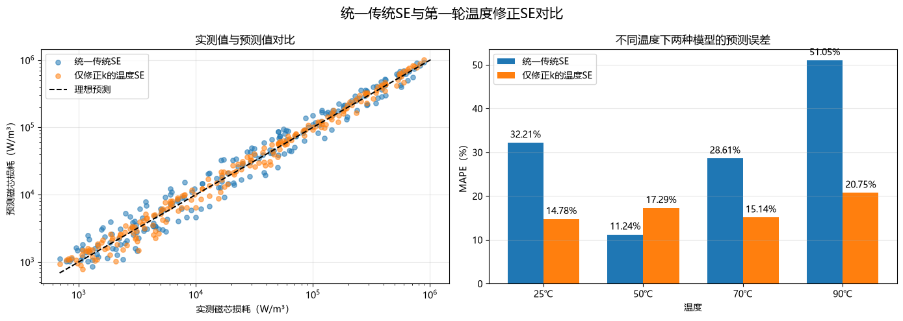

#### 3、**第二轮温度修正：引入频率指数 \($\alpha$\) 的温度变化**

第一轮温度修正仅考虑了温度对比例系数 \($k$\) 的影响，使验证集MAPE由31.1635%下降至17.0020%。但是，不同温度下仍然存在一定的系统预测误差，说明温度不仅改变磁芯损耗的整体大小，还可能改变频率对磁芯损耗的影响程度。

因此，第二轮优化在保留 \($k(T)$\) 的基础上，进一步假设频率指数 \($\alpha$\) 随温度线性变化，而磁通密度指数 \($\beta$\) 暂时保持不随温度变化。

温度归一化变量仍定义为：
$$
\theta=\frac{T-57.5}{32.5}
$$
参数 \($k$\) 的温度修正形式为：
$$
k(T)=k_0\exp(c_1\theta)
$$
频率指数的温度修正形式为：
$$
\alpha(T)=\alpha_0+\alpha_1\theta
$$
将其代入斯坦麦茨方程，得到第二轮温度修正方程：
$$
P= k_0\exp(c_1\theta) f^{\alpha_0+\alpha_1\theta} B_m^{\beta_0}
$$
对方程两侧取自然对数：
$$
ln P = \ln k_0+c_1\theta +\alpha_0\ln f +\alpha_1\theta\ln f +\beta_0\ln B_m
$$
该方程仍然是关于参数的线性方程，可以采用多元线性回归进行求解。

拟合得到的参数如下：

| 参数           | 参数含义                      | 估计值      |
| -------------- | ----------------------------- | ----------- |
| ($ln k_0$)     | 回归模型截距                  | -1.76966362 |
| \($k_0$\)      | 指数反变换后的原始系数        | 0.17039030  |
| \($s$\)        | Duan反变换校正因子            | 1.01511372  |
| \($k_0^\ast$\) | 校正后的比例系数              | 0.17296553  |
| \($\alpha_0$\) | 中心温度下的频率指数          | 1.62098295  |
| \($\alpha_1$\) | 频率指数的温度变化系数        | 0.29134451  |
| \($\beta_0$\)  | 磁通密度指数                  | 2.52563163  |
| \($c_1$\)      | 比例系数 \(k\) 的温度影响系数 | -3.79648214 |

校正后的比例系数为：
$$
k_0^\ast=s\exp(\ln k_0)
$$
因此，第二轮温度修正方程为：
$$
\hat P = 0.17296553 \exp(-3.79648214\theta) f^{1.62098295+0.29134451\theta} B_m^{2.52563163}
$$
其中：
$$
\theta=\frac{T-57.5}{32.5}
$$
由于 \($c_1<0$\)，说明比例系数 \($k(T)$\) 随温度升高而减小；由于 \($\alpha_1>0$\)，说明频率指数 \($\alpha(T)$\) 随温度升高而增大。

需要注意的是，\($c_1$\) 和 \($\alpha_1$\) 需要结合解释。由于模型中同时包含 \($\theta$\) 和 \($\theta\ln f$\)，二者共同描述温度效应，不能只根据 \($c_1$\) 的大小单独判断温度影响程度。

三种模型在验证集上的评价结果如下：

| 模型                                 | MSE             | MAE        | RMSE       | MAPE     | \($R^2$\) |
| ------------------------------------ | --------------- | ---------- | ---------- | -------- | --------- |
| 统一传统SE                           | 1532840666.9505 | 20579.7077 | 39151.5091 | 31.1635% | 0.954671  |
| 第一轮：仅修正 \($k$\)               | 721436665.6933  | 12615.3081 | 26859.5731 | 17.0020% | 0.978666  |
| 第二轮：修正 \($k$\) 和 \($\alpha$\) | 775200606.0931  | 12430.2511 | 27842.4246 | 13.8302% | 0.977076  |

第二轮模型相对于第一轮模型的变化如下：

| 评价指标  | 第一轮     | 第二轮     | 变化情况     |
| --------- | ---------- | ---------- | ------------ |
| MAE       | 12615.3081 | 12430.2511 | 降低1.47%    |
| RMSE      | 26859.5731 | 27842.4246 | 上升3.66%    |
| MAPE      | 17.0020%   | 13.8302%   | 降低18.66%   |
| \($R^2$\) | 0.978666   | 0.977076   | 下降0.001590 |

MAPE的降低比例为：
$$
\frac{17.0020-13.8302}{17.0020}\times100\% = 18.66\%
$$
RMSE的变化率为：
$$
\frac{26859.5731-27842.4246}{26859.5731}\times100\% = -3.66\%
$$
负值表示第二轮模型的RMSE没有降低，而是上升了3.66%。

第二轮模型相对于统一传统SE的MAPE降低比例为：
$$
\frac{31.1635-13.8302}{31.1635}\times100\% = 55.62\%
$$
加入 $\alpha(T)$ 后，模型的MAPE由第一轮的17.0020%进一步下降至13.8302%，MAE也从12615.3081下降至12430.2511，说明模型对不同数量级样本的相对预测能力得到改善。

但是，第二轮模型的RMSE略有上升，\($R^2$\) 由0.978666下降至0.977076。这表明加入 \($\alpha(T)$\) 后，模型虽然改善了大多数样本的相对误差，但部分磁芯损耗较大的样本出现了更大的绝对误差。由于RMSE对大误差较为敏感，因此出现了MAPE下降而RMSE上升的情况。

不同温度下三种模型的验证结果如下：

| 温度 | 样本数 | 统一SE MAPE | 第一轮MAPE | 第二轮MAPE | 第二轮相对第一轮降低比例 | 统一SE \($R^2$\) | 第一轮 \($R^2$\) | 第二轮 \($R^2$\) |
| ---- | ------ | ----------- | ---------- | ---------- | ------------------------ | ---------------- | ---------------- | ---------------- |
| 25℃  | 55     | 32.2105%    | 14.7763%   | 9.3067%    | 37.02%                   | 0.906924         | 0.978027         | 0.976403         |
| 50℃  | 51     | 11.2386%    | 17.2881%   | 14.6017%   | 15.54%                   | 0.998360         | 0.978969         | 0.985696         |
| 70℃  | 53     | 28.6143%    | 15.1422%   | 14.8348%   | 2.03%                    | 0.941335         | 0.995045         | 0.990829         |
| 90℃  | 55     | 51.0487%    | 20.7545%   | 16.6704%   | 19.68%                   | 0.919913         | 0.950744         | 0.926388         |

加入 \($\alpha(T)$\) 后，四种温度下的MAPE相对于第一轮模型均有所下降。其中，25℃下的MAPE由14.7763%下降至9.3067%，降低比例达到37.02%；90℃下的MAPE由20.7545%下降至16.6704%，降低比例达到19.68%。

50℃下的MAPE也由17.2881%下降至14.6017%，但仍高于统一传统SE的11.2386%。70℃下的改善幅度相对较小，仅为2.03%。

不同温度下的频率指数为：

| 温度 | \($\theta$\) | \($\alpha(T)$\) |
| ---- | ------------ | --------------- |
| 25℃  | -1.000000    | 1.329638        |
| 50℃  | -0.230769    | 1.553750        |
| 70℃  | 0.384615     | 1.733039        |
| 90℃  | 1.000000     | 1.912327        |

频率指数 \($\alpha(T)$\) 从25℃下的1.329638逐渐增加到90℃下的1.912327，说明温度越高，磁芯损耗对频率变化越敏感。这与前面对不同温度分别拟合SE参数时观察到的变化趋势一致。

从相对误差角度看，第二轮模型优于第一轮模型，并且四种温度下的MAPE都得到降低，说明引入 \($\alpha(T)$\) 具有实际作用。因此，可以暂时保留频率指数的温度修正项。

但第二轮模型的RMSE和 \($R^2$\) 略有下降，说明当前模型仍然存在一定不足。下一步可以在保留 \($k(T)$\) 和 \($\alpha(T)$\) 的基础上，检验磁通密度指数 \($\beta$\) 是否需要加入较弱的温度变化项。

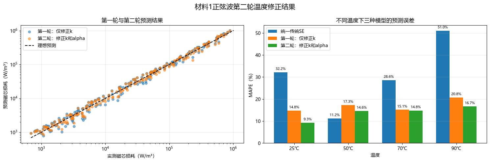

#### 4、**第三轮温度修正：引入磁通密度指数 \($\beta$\) 的温度变化**

第二轮模型在比例系数 \($k$\) 和频率指数 \($\alpha$\) 中加入了温度因素，使模型的MAPE进一步降低，但RMSE有所升高，\($R^2$\) 略有下降。说明模型对磁通密度与磁芯损耗之间关系的描述仍存在不足。

因此，第三轮优化在第二轮模型的基础上，进一步假设磁通密度指数 \(\beta\) 随温度线性变化：
$$
\beta(T)=\beta_0+\beta_1\theta
$$
温度归一化变量仍定义为：
$$
\theta=\frac{T-57.5}{32.5}
$$
同时保留前两轮得到的温度修正形式：
$$
k(T)=k_0\exp(c_1\theta)
$$

$$
\alpha(T)=\alpha_0+\alpha_1\theta\
$$

由此构造第三轮温度修正方程：
$$
P= k_0\exp(c_1\theta) f^{\alpha_0+\alpha_1\theta} B_m^{\beta_0+\beta_1\theta}
$$
对方程两侧取自然对数：
$$
\ln P= \ln k_0+c_1\theta +\alpha_0\ln f+\alpha_1\theta\ln f +\beta_0\ln B_m+\beta_1\theta\ln B_m
$$
拟合得到的参数如下：

| 参数           | 参数含义                        | 估计值      |
| -------------- | ------------------------------- | ----------- |
| ($ln k_0$\)    | 回归模型截距                    | -1.76232166 |
| \($k_0$\)      | 指数反变换后的原始系数          | 0.17164590  |
| \($s$\)        | Duan反变换校正因子              | 1.01442798  |
| \($k_0^\ast$\) | 校正后的比例系数                | 0.17412240  |
| \($\alpha_0$\) | 中心温度下的频率指数            | 1.61999447  |
| \($\alpha_1$\) | 频率指数的温度变化系数          | 0.33359827  |
| \($\beta_0$\)  | 中心温度下的磁通密度指数        | 2.52473467  |
| \($\beta_1$\)  | 磁通密度指数的温度变化系数      | 0.06817450  |
| \($c_1$\)      | 比例系数 \($k$\) 的温度影响系数 | -4.09926667 |

校正后的比例系数为：
$$
k_0^\ast=s\exp(\ln k_0)
$$
因此，第三轮温度修正方程为：
$$
\hat P= 0.17412240 \exp(-4.09926667\theta) f^{1.61999447+0.33359827\theta} B_m^{2.52473467+0.06817450\theta}
$$
其中：
$$
\theta=\frac{T-57.5}{32.5}
$$
四种模型在验证集上的评价结果如下：

| 模型                                              | MSE             | MAE        | RMSE       | MAPE     | \($R^2$\) |
| ------------------------------------------------- | --------------- | ---------- | ---------- | -------- | --------- |
| 统一传统SE                                        | 1532840666.9505 | 20579.7077 | 39151.5091 | 31.1635% | 0.954671  |
| 第一轮：仅修正 \($k$\)                            | 721436665.6933  | 12615.3081 | 26859.5731 | 17.0020% | 0.978666  |
| 第二轮：修正 \($k$\) 和 \($\alpha$\)              | 775200606.0931  | 12430.2511 | 27842.4246 | 13.8302% | 0.977076  |
| 第三轮：修正 \($k$\)、\($\alpha$\) 和 \($\beta$\) | 536943773.6114  | 11232.9471 | 23172.0472 | 13.5616% | 0.984122  |

第三轮模型相对于第二轮模型的指标变化如下：

| 评价指标  | 第二轮     | 第三轮     | 改善情况     |
| --------- | ---------- | ---------- | ------------ |
| MAE       | 12430.2511 | 11232.9471 | 降低9.63%    |
| RMSE      | 27842.4246 | 23172.0472 | 降低16.77%   |
| MAPE      | 13.8302%   | 13.5616%   | 降低1.94%    |
| \($R^2$\) | 0.977076   | 0.984122   | 提高0.007046 |

MAPE降低比例为：
$$
\frac{13.8302-13.5616}{13.8302}\times100\% = 1.94\%
$$
RMSE降低比例为：
$$
\frac{27842.4246-23172.0472}{27842.4246}\times100\% = 16.77\%
$$
MAE降低比例为：
$$
\frac{12430.2511-11232.9471}{12430.2511}\times100\% = 9.63\%
$$
决定系数提高量为：
$$
0.984122-0.977076 = 0.007046
$$
第三轮模型相对于统一传统SE的MAPE降低比例为：
$$
\frac{31.1635-13.5616}{31.1635}\times100\% = 56.48\%
$$
第三轮模型不仅进一步降低了MAPE，还显著降低了MAE和RMSE，同时使 \($R^2$\) 从第二轮的0.977076提高至0.984122。这说明虽然 \($\beta$\) 随温度的变化幅度较小，但保留该温度变化项有助于降低较大损耗样本的预测误差。

不同温度下四种模型的验证结果如下：

| 温度 | 样本数 | 统一SE MAPE | 第一轮MAPE | 第二轮MAPE | 第三轮MAPE | 第三轮相对第二轮变化率 | 第三轮 \($R^2$\) |
| ---- | ------ | ----------- | ---------- | ---------- | ---------- | ---------------------- | ---------------- |
| 25℃  | 55     | 32.2105%    | 14.7763%   | 9.3067%    | 8.5651%    | 7.97%                  | 0.983224         |
| 50℃  | 51     | 11.2386%    | 17.2881%   | 14.6017%   | 14.2687%   | 2.28%                  | 0.991852         |
| 70℃  | 53     | 28.6143%    | 15.1422%   | 14.8348%   | 15.1570%   | -2.17%                 | 0.987091         |
| 90℃  | 55     | 51.0487%    | 20.7545%   | 16.6704%   | 16.3649%   | 1.83%                  | 0.954273         |

第三轮模型在25℃、50℃和90℃下的MAPE均低于第二轮模型，其中25℃下的MAPE由9.3067%下降至8.5651%，改善最为明显。

70℃下的MAPE由14.8348%小幅上升至15.1570%，增幅约为2.17%。但是，第三轮模型在总体MAE、RMSE、MAPE和 \($R^2$\) 上均优于第二轮，因此局部温度下的轻微误差增加不影响第三轮模型的总体优势。

不同温度下的频率指数和磁通密度指数如下：

| 温度 | \($\theta$\) | \($\alpha(T)$\) | \($\beta(T)$\) |
| ---- | ------------ | --------------- | -------------- |
| 25℃  | -1.000000    | 1.286396        | 2.456560       |
| 50℃  | -0.230769    | 1.543010        | 2.509002       |
| 70℃  | 0.384615     | 1.748302        | 2.550956       |
| 90℃  | 1.000000     | 1.953593        | 2.592909       |

从25℃升高至90℃时，频率指数的相对变化率为：
$$
\frac{1.953593-1.286396}{1.286396}\times100\% = 51.87\%
$$
磁通密度指数的相对变化率为：
$$
\frac{2.592909-2.456560}{2.456560}\times100\% = 5.55\%
$$
结果表明，\($\alpha(T)$\) 的相对变化幅度达到51.87%，而 \($\beta(T)$\) 的相对变化幅度只有5.55%。因此，温度主要改变频率指数 \($\alpha$\)，对磁通密度指数 \($\beta$\) 的影响相对较弱。

这一结果与前面对不同温度下SE参数变化规律的观察一致，即应重点描述 \($k$\) 和 \($\alpha$\) 的温度变化，同时保留一个较弱的 \($\beta$\) 温度修正项。

综合各项评价指标，第三轮模型是目前三轮修正中效果最好的模型。但在将其确定为最终修正方程之前，还需要通过五折交叉验证检验其稳定性，并比较四种模型在不同数据划分下的平均预测效果。

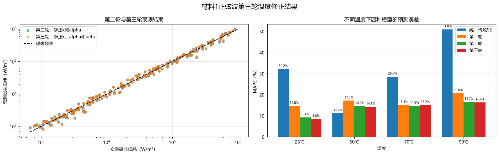

#### 5、**第四轮温度修正：增加 \($k(T)$\) 的二次温度项**

前三轮优化结果表明，温度会同时影响比例系数 \($k$\)、频率指数 \($\alpha$\) 和磁通密度指数 \($\beta$\)。其中，\(\alpha\) 的温度变化较为明显，\($\beta$\) 的温度变化相对较弱。

考虑到不同温度下分别拟合得到的 \($\ln k$\) 虽然总体随温度下降，但不完全呈线性变化，因此在第三轮模型基础上，为 \($\ln k(T)$\) 增加二次温度项。

温度归一化变量定义为：
$$
\theta=\frac{T-57.5}{32.5}
$$
参数 \($k$\) 的温度修正形式为：
$$
ln k(T) = \ln k_0+c_1\theta+c_2\theta^2
$$
等价地：
$$
k(T) = k_0\exp(c_1\theta+c_2\theta^2)
$$
频率指数和磁通密度指数仍采用线性温度修正：
$$
\alpha(T)=\alpha_0+\alpha_1\theta
$$

$$
\beta(T)=\beta_0+\beta_1\theta
$$

由此得到第四轮温度修正方程：
$$
P= k_0\exp(c_1\theta+c_2\theta^2) f^{\alpha_0+\alpha_1\theta} B_m^{\beta_0+\beta_1\theta}
$$
对方程两侧取自然对数：
$$
ln P = \ln k_0+c_1\theta+c_2\theta^2 +\alpha_0\ln f+\alpha_1\theta\ln f +\beta_0\ln B_m+\beta_1\theta\ln B_m
$$
第四轮模型拟合得到的参数如下：

| 参数           | 参数含义                   | 估计值      |
| -------------- | -------------------------- | ----------- |
| \($\ln k_0$\)  | 回归模型截距               | -1.80339846 |
| \($k_0$\)      | 指数反变换后的原始系数     | 0.16473808  |
| \($s$\)        | Duan反变换校正因子         | 1.01307604  |
| \($k_0^\ast$\) | 校正后的比例系数           | 0.16689220  |
| \($\alpha_0$\) | 中心温度下的频率指数       | 1.61714867  |
| \($\alpha_1$\) | 频率指数的温度变化系数     | 0.32720088  |
| \($\beta_0$\)  | 中心温度下的磁通密度指数   | 2.52028661  |
| \($\beta_1$)   | 磁通密度指数的温度变化系数 | 0.06417089  |
| \($c_1$\)      | \(\ln k\) 的一次温度系数   | -4.03364232 |
| \($c_2$\)      | \(\ln k\) 的二次温度系数   | 0.11019555  |

校正后的比例系数为：
$$
k_0^\ast=s\exp(\ln k_0)
$$
因此，第四轮温度修正方程为：
$$
\hat P= 0.16689220 \exp(-4.03364232\theta+0.11019555\theta^2) f^{1.61714867+0.32720088\theta} B_m^{2.52028661+0.06417089\theta}
$$
其中：
$$
\theta=\frac{T-57.5}{32.5}
$$
统一传统SE及四轮温度修正模型的验证集评价结果如下：

| 模型                                              | MSE             | MAE        | RMSE       | MAPE     | \($R^2$\) |
| ------------------------------------------------- | --------------- | ---------- | ---------- | -------- | --------- |
| 统一传统SE                                        | 1532840666.9505 | 20579.7077 | 39151.5091 | 31.1635% | 0.954671  |
| 第一轮：修正 \($k$\)                              | 721436665.6933  | 12615.3081 | 26859.5731 | 17.0020% | 0.978666  |
| 第二轮：修正 \($k$\) 和 \($\alpha$\)              | 775200606.0931  | 12430.2511 | 27842.4246 | 13.8302% | 0.977076  |
| 第三轮：修正 \($k$\)、\($\alpha$\) 和 \($\beta$\) | 536943773.6114  | 11232.9471 | 23172.0472 | 13.5616% | 0.984122  |
| 第四轮：增加 \($k$\) 的二次温度项                 | 364019275.5338  | 8558.3205  | 19079.2892 | 12.0527% | 0.989235  |

每一轮模型相对于上一轮的指标变化如下：

| 当前模型 | 对比模型   | MAE降低比例 | RMSE降低比例 | MAPE降低比例 | \($R^2$\) 变化量 |
| -------- | ---------- | ----------- | ------------ | ------------ | ---------------- |
| 第一轮   | 统一传统SE | 38.70%      | 31.40%       | 45.44%       | +0.023995        |
| 第二轮   | 第一轮     | 1.47%       | -3.66%       | 18.66%       | -0.001590        |
| 第三轮   | 第二轮     | 9.63%       | 16.77%       | 1.94%        | +0.007046        |
| 第四轮   | 第三轮     | 23.81%      | 17.66%       | 11.13%       | +0.005114        |

其中，负的RMSE降低比例表示对应指标发生了上升。第二轮虽然降低了MAPE，但RMSE上升3.66%，\($R^2$\) 下降0.001590。第三轮和第四轮则同时改善了各项总体评价指标。

各轮修正模型相对于统一传统SE的改善程度如下：

| 模型   | MAE降低比例 | RMSE降低比例 | MAPE降低比例 | \($R^2$\) 提高量 |
| ------ | ----------- | ------------ | ------------ | ---------------- |
| 第一轮 | 38.70%      | 31.40%       | 45.44%       | +0.023995        |
| 第二轮 | 39.60%      | 28.89%       | 55.62%       | +0.022405        |
| 第三轮 | 45.42%      | 40.81%       | 56.48%       | +0.029450        |
| 第四轮 | 58.41%      | 51.27%       | 61.32%       | +0.034564        |

第四轮模型相对于第三轮模型的MAPE降低比例为：
$$
\frac{13.5616-12.0527}{13.5616}\times100\% = 11.13\%
$$
RMSE降低比例为：
$$
\frac{23172.0472-19079.2892}{23172.0472}\times100\% = 17.66\%
$$
MAE降低比例为：
$$
\frac{11232.9471-8558.3205}{11232.9471}\times100\% = 23.81\%
$$
决定系数提高量为：
$$
0.989235-0.984122 = 0.005114
$$
第四轮模型相对于统一传统SE的MAPE降低比例为：
$$
\frac{31.1635-12.0527}{31.1635}\times100\% = 61.32\%
$$
RMSE降低比例为：
$$
\frac{39151.5091-19079.2892}{39151.5091}\times100\% = 51.27\%
$$
决定系数由0.954671提高至0.989235，说明第四轮温度修正方程能够解释约98.92%的磁芯损耗变化。

不同温度下各模型的MAPE如下：

| 温度 | 统一SE   | 第一轮   | 第二轮   | 第三轮   | 第四轮   |
| ---- | -------- | -------- | -------- | -------- | -------- |
| 25℃  | 32.2105% | 14.7763% | 9.3067%  | 8.5651%  | 7.6839%  |
| 50℃  | 11.2386% | 17.2881% | 14.6017% | 14.2687% | 9.9915%  |
| 70℃  | 28.6143% | 15.1422% | 14.8348% | 15.1570% | 13.5523% |
| 90℃  | 51.0487% | 20.7545% | 16.6704% | 16.3649% | 16.8879% |

不同温度下各模型的最小MAPE如下：

| 温度 | MAPE最小的模型 | 最小MAPE |
| ---- | -------------- | -------- |
| 25℃  | 第四轮         | 7.6839%  |
| 50℃  | 第四轮         | 9.9915%  |
| 70℃  | 第四轮         | 13.5523% |
| 90℃  | 第三轮         | 16.3649% |

第四轮模型在25℃、50℃和70℃下均取得了所有模型中的最小MAPE。在90℃下，第四轮MAPE为16.8879%，略高于第三轮的16.3649%，但仍显著低于统一传统SE的51.0487%。

第四轮模型在不同温度下的参数如下：

| 温度 | \($\theta$\) | \($k(T)$\)                 | \($\alpha(T)$\) | \($\beta(T)$\) |
| ---- | ------------ | -------------------------- | --------------- | -------------- |
| 25℃  | -1.000000    | $1.05216044\times10^{1}$   | 1.289948        | 2.456116       |
| 50℃  | -0.230769    | $4.25837173\times10^{-1}$  | 1.541641        | 2.505478       |
| 70℃  | 0.384615     | $3.59542873\times10^{-2}$  | 1.742995        | 2.544968       |
| 90℃  | 1.000000     | $3.29993028\times10^{-3}\$ | 1.944350        | 2.584457       |

随着温度升高，\($k(T)$\) 呈明显下降趋势，而 \($\alpha(T)$\) 和 \($\beta(T)$\) 均逐渐增加。其中，\($\alpha(T)$\) 的变化幅度明显大于 \($\beta(T)$\)，再次说明温度主要改变频率指数，对磁通密度指数的影响相对较弱。

由于：

 $c_1+2c_2\theta<0,\qquad -1\leq\theta\leq1$ 

所以在25℃至90℃范围内，\($\ln k(T)$\) 仍然随温度单调下降。正的二次项 \($c_2\theta^2$\) 主要用于描述下降速度的轻微变化，并没有改变 \($k(T)$\) 的总体下降方向。

综合结果表明，第四轮模型在总体MSE、MAE、RMSE、MAPE和 \($R^2$\) 上均优于前三轮模型和统一传统SE。增加 \($\ln k(T)$\) 的二次温度项能够有效描述比例系数随温度变化的非线性特征。

因此，可以将第四轮温度修正方程作为当前候选模型。下一步需要对统一传统SE和四轮修正模型进行五折交叉验证，以检验第四轮模型的改善是否能够在不同数据划分下稳定保持。

### 最终模型选择

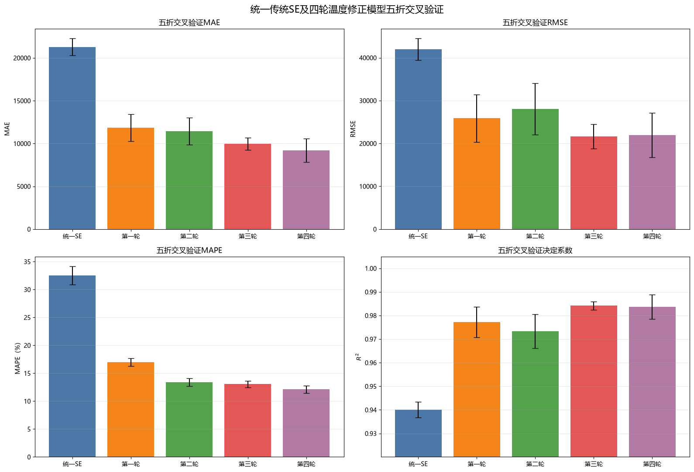

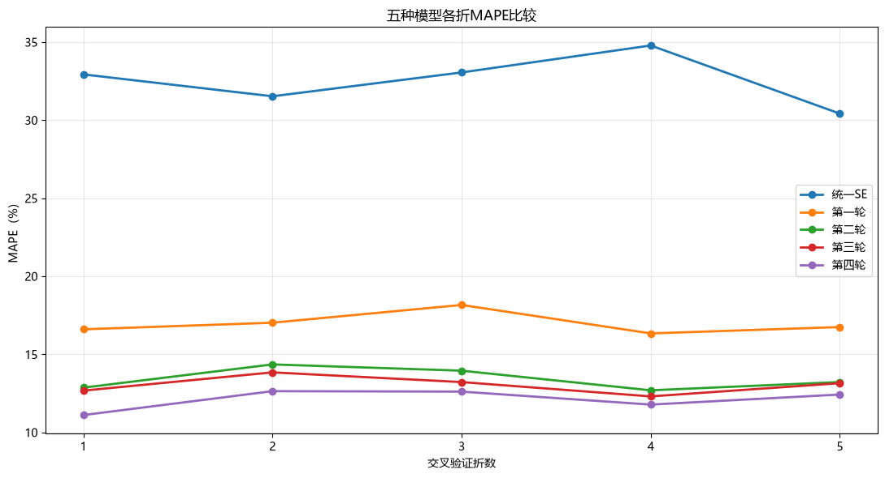

五折交叉验证说明：第四轮并不是在某一次数据划分中偶然取得好结果，它在五折中的MAPE都保持最低，因此没有明显的相对误差过拟合现象。

五种模型的综合表现可以概括为：

| 评价方面       | 表现最好的模型 | 结论                       |
| -------------- | -------------- | -------------------------- |
| MAE            | 第四轮         | 平均绝对误差最小           |
| MAPE           | 第四轮         | 平均相对误差最小           |
| RMSE           | 第三轮         | 对少数大误差样本控制更好   |
| \($R^2$\)      | 第三轮         | 决定系数略高               |
| 各折MAPE稳定性 | 第四轮         | 五折中均保持最低水平       |
| 模型复杂度     | 第三轮更简单   | 第四轮只多一个二次温度参数 |

从五折MAPE折线图可以看出：

- 统一传统SE的MAPE约为30%～35%，误差最大；
- 第一轮下降到约16%～18%；
- 第二轮下降到约13%～14%；
- 第三轮进一步下降到约12%～14%；
- 第四轮在五折中均处于最低位置，约为11%～13%。

第四轮的平均MAPE约为12.1%，第三轮约为13.0%，说明增加 \($k(T)$\) 的二次温度项后，相对预测误差获得了稳定改善。

但是，从RMSE和 \($R^2$\) 可以看出，第三轮略优于第四轮。这说明第四轮改善了大部分中小损耗样本的相对误差，但在少数损耗较大的样本上，预测误差可能稍大，从而导致RMSE和 \($R^2$\) 没有同步达到最优。

由于磁芯损耗跨越多个数量级，单独使用 \($R^2$\) 和RMSE容易受到大损耗样本支配。相比之下，MAPE能够更均衡地反映不同数量级样本的相对预测效果。因此，本题应将MAPE和MAE作为主要判断指标，以RMSE和 \($R^2$\) 作为辅助指标。

综合比较后，建议选择第四轮作为最终温度修正方程，理由是：

- 五折平均MAPE最低；
- 五折平均MAE最低；
- 每一折的MAPE都低于其他模型；
- 相对于统一传统SE，误差下降显著；
- 只比第三轮多一个二次温度参数，复杂度增加有限；
- \($R^2$\) 仍保持在约0.98以上；
- 二次温度项具有明确的参数变化解释。

第三轮可以作为简化备选模型。如果实际应用更加关注高损耗样本产生的大额绝对误差，可以选择第三轮；如果更重视整个数据范围内的相对预测精度，则第四轮更合适。

因此，模型选择结论为：以第四轮为最终模型，第三轮作为简化对照模型。下一步应使用材料1全部1067条正弦波样本重新拟合第四轮模型，得到最终方程参数。当前第四轮参数来自80%训练集，只用于模型评价，不能直接作为最终参数。